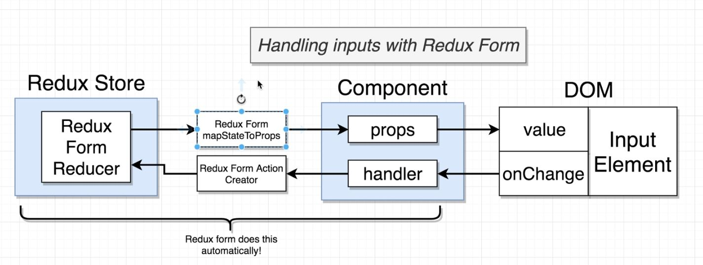

## React forms

React forms is a little bit repetitive, and to use it with react we prefere to use **redux-form** library that do a lot of things as shown in the image bellow:


### Installation

`npm i redux-form`

**on the reducers index**

```javascript
import { combineReducers } from "redux";
import { reduce as formReducer } from "redux-form";
import authReducer from "./authReducer";

export default combineReducers({
  auth: authReducer,
  form: formReducer,
});
```

**On the Component we want to use Redux form on**

```javascript
import { Field, reduxForm} from "redux-form";

class CreateStream extends React.Component {
  renderInput({ input }) {
    return <input {...input} />
  }

  render() {
    return {
      <form>
        <Field name="title" component={this.renderInput}>
      </form>
    }
  }
}

export default reduxForm({
  form: 'streamCreate'
})(componentName)
```

The `<Field />` Component itself is don't know what is a text field or a checkbox ... it's only here to help redux implement and make redux easy to use with react here the `component` keyword came to define the inputs using functionor a component

The `{...input}` this syntax here is recommended instead of pass the value and the onChange and ler and so one the field it self need all properties came from the value object because of redux needs so we pass this special JSX destruction
