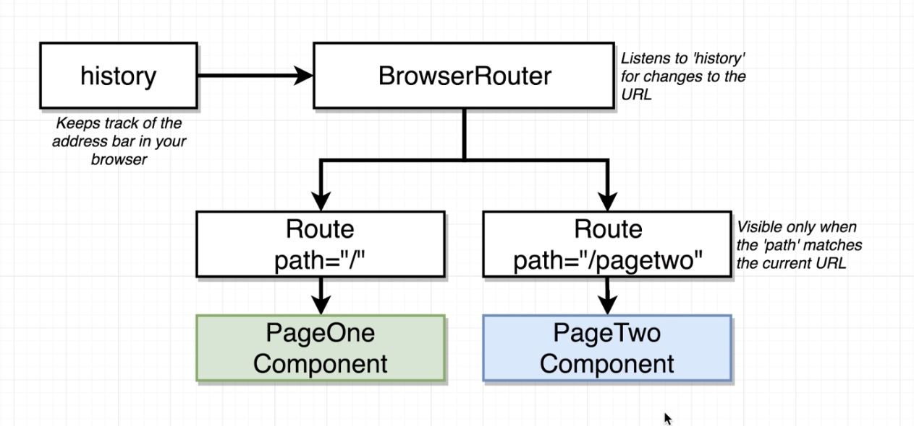

## React Router

How React Router Works ?

exact keyword: as we know we can match more than one Route with the same path with the exact keyword we force react-router to change his behavior from contains to ===

**extractedPath.contains(path) for example,**

1. is /page contains / ? yes so show it and move to the next route.
2. is /page contains the path /page? yes so show it and move to the next route.
3. is /page contains /page/5? no, it's not so don't show it.

**and when we use exact={true} the rule switch to: extractedPath === path**

1. is /page match exact / ? no, it's not so don't show it.
2. is /page match exact /page? yes so show it and move to the next route.
3. is /page match exact /page/5? no, it's not so don't show it.
